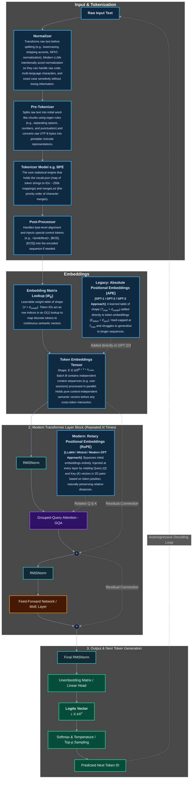

# GPT Flow Diagram

```mermaid
%%{init: {
  'theme': 'dark',
  'themeVariables': {
    'darkMode': true,
    'background': '#0f172a',
    'primaryColor': '#1e293b',
    'primaryTextColor': '#f8fafc',
    'primaryBorderColor': '#38bdf8',
    'lineColor': '#94a3b8',
    'fontFamily': 'inter, system-ui, -apple-system, sans-serif'
  }
}}%%
flowchart TD
    %% Class Styling Definitions
    classDef inputStyle fill:#0f2942,stroke:#38bdf8,stroke-width:2px,color:#e0f2fe;
    classDef attnStyle fill:#2e1065,stroke:#a855f7,stroke-width:2px,color:#f3e8ff;
    classDef ffnStyle fill:#451a03,stroke:#f59e0b,stroke-width:2px,color:#fef3c7;
    classDef normStyle fill:#112a36,stroke:#2dd4bf,stroke-width:2px,color:#ccfbf1;
    classDef outputStyle fill:#064e3b,stroke:#34d399,stroke-width:2px,color:#ecfdf5;
    classDef resStyle fill:#1e293b,stroke:#64748b,stroke-width:1.5px,color:#cbd5e1;

    subgraph IN ["<b><big>Input & Tokenization</big></b>"]
        A1["<b>Raw Input Text</b>"]:::inputStyle --> B1["<b>Normalizer</b><br><small>Transforms raw text before splitting (e.g., lowercasing, stripping accents, NFKC normalization). Modern LLMs intentionally avoid normalization so they can handle raw code, multi-language characters, and exact case sensitivity without losing information.</small>"]:::inputStyle
        B1 --> C1["<b>Pre-Tokenizer</b><br><small>Splits raw text into initial word-like chunks using regex rules (e.g., separating spaces, numbers, and punctuation) and converts raw UTF-8 bytes into printable Unicode representations.</small>"]:::inputStyle
        C1 --> D1["<b>Tokenizer Model e.g. BPE</b><br><small>The core statistical engine that holds the vocab.json (map of token strings to IDs: ~250k mappings) and merges.txt (the priority order of character merges).</small>"]:::inputStyle
        D1 --> E1["<b>Post-Processor</b><br><small>Handles byte-level alignment and injects special control tokens (e.g., <|endoftext|>, [BOS], [EOS]) into the encoded sequence if needed.</small>"]:::inputStyle
    end

    subgraph EMB ["<b><big>Embeddings</big></b>"]
        E1 --> D["<b>Embedding Matrix Lookup (<i>W<sub>E</sub></i>)</b><br><small>Learnable weight table of shape (<i>V</i> &times; <i>d<sub>model</sub></i>). Token IDs act as row indices in an <i>O</i>(1) lookup to map discrete tokens to continuous semantic vectors.</small>"]:::inputStyle
        D --> E["<b>Token Embeddings Tensor</b><br><small>Shape: <i>E</i> &isin; &#8477;<sup><i>B</i> &times; <i>T</i> &times; <i>d<sub>model</sub></i></sup>. Batch <i>B</i> contains independent context sequences (e.g. user sessions) processed in parallel. Holds pure context-independent semantic vectors before any cross-token interaction.</small>"]:::inputStyle
        
        APE["<b>Legacy: Absolute Positional Embeddings (APE)</b><br><small><b>[GPT-1 / GPT-2 / GPT-3 Approach]</b>: A learned table of shape (<i>T<sub>max</sub></i> &times; <i>d<sub>model</sub></i>) added directly to token embeddings (<i>E<sub>token</sub></i> + <i>E<sub>pos</sub></i>). Hard-capped at <i>T<sub>max</sub></i> and struggles to generalize to longer sequences.</small>"]:::inputStyle -.->|Added directly in GPT-2/3| E
    end


    subgraph BLK ["2. Modern Transformer Layer Block (Repeated <i>N</i> Times)"]
        E --> PreNorm1[RMSNorm]:::normStyle
        PreNorm1 --> Attn[Grouped-Query Attention - GQA]:::attnStyle
        
        RoPE["<b>Modern: Rotary Positional Embeddings (RoPE)</b><br><small><b>[LLaMA / Mistral / Modern GPT Approach]</b>: Bypasses initial embeddings entirely. Injected at every layer by rotating Query (<i>Q</i>) and Key (<i>K</i>) vectors in 2D pairs based on token position, naturally preserving relative distances.</small>"]:::inputStyle -.->|Rotates Q & K| Attn

        Attn --> Add1(( + )):::resStyle
        E -.->|Residual Connection| Add1

        Add1 --> PreNorm2[RMSNorm]:::normStyle
        PreNorm2 --> FFN[Feed-Forward Network / MoE Layer]:::ffnStyle
        FFN --> Add2(( + )):::resStyle
        Add1 -.->|Residual Connection| Add2
    end

    subgraph OUT ["3. Output & Next Token Generation"]
        Add2 --> FinalNorm[Final RMSNorm]:::normStyle
        FinalNorm --> Projection[Unembedding Matrix / Linear Head]:::outputStyle
        Projection --> Logits["<b>Logits Vector</b><br><small><i>L</i> &isin; &#8477;<sup><i>V</i></sup></small>"]:::outputStyle
        Logits --> Sampling[Softmax & Temperature / Top-p Sampling]:::outputStyle
        Sampling --> NextToken[Predicted Next Token ID]:::outputStyle
    end

    %% Autoregressive Generation Loop
    NextToken -.->|Autoregressive Decoding Loop| A1
```
