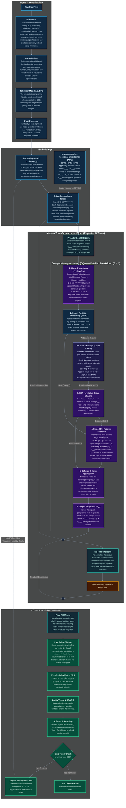

# GPT Flow Diagram

```mermaid
%%{init: {
  'theme': 'dark',
  'themeVariables': {
    'darkMode': true,
    'background': '#0f172a',
    'primaryColor': '#1e293b',
    'primaryTextColor': '#f8fafc',
    'primaryBorderColor': '#38bdf8',
    'lineColor': '#94a3b8',
    'fontFamily': 'inter, system-ui, -apple-system, sans-serif'
  }
}}%%
flowchart TD
    %% Class Styling Definitions
    classDef inputStyle fill:#0f2942,stroke:#38bdf8,stroke-width:2px,color:#e0f2fe;
    classDef attnStyle fill:#2e1065,stroke:#a855f7,stroke-width:2px,color:#f3e8ff;
    classDef ffnStyle fill:#451a03,stroke:#f59e0b,stroke-width:2px,color:#fef3c7;
    classDef normStyle fill:#112a36,stroke:#2dd4bf,stroke-width:2px,color:#ccfbf1;
    classDef outputStyle fill:#064e3b,stroke:#34d399,stroke-width:2px,color:#ecfdf5;
    classDef resStyle fill:#1e293b,stroke:#64748b,stroke-width:1.5px,color:#cbd5e1;
    classDef cacheStyle fill:#1e1b4b,stroke:#818cf8,stroke-width:2px,color:#e0e7ff;

    subgraph IN ["<b><big>Input & Tokenization</big></b>"]
        A1["<b>Raw Input Text</b>"]:::inputStyle --> B1["<b>Normalizer</b><br><small>Transforms raw text before splitting (e.g., lowercasing, stripping accents, NFKC normalization). Modern LLMs intentionally avoid normalization so they can handle raw code, multi-language characters, and exact case sensitivity without losing information.</small>"]:::inputStyle
        B1 --> C1["<b>Pre-Tokenizer</b><br><small>Splits raw text into initial word-like chunks using regex rules (e.g., separating spaces, numbers, and punctuation) and converts raw UTF-8 bytes into printable Unicode representations.</small>"]:::inputStyle
        C1 --> D1["<b>Tokenizer Model e.g. BPE</b><br><small>The core statistical engine that holds the vocab.json (map of token strings to IDs: ~250k mappings) and merges.txt (the priority order of character merges).</small>"]:::inputStyle
        D1 --> E1["<b>Post-Processor</b><br><small>Handles byte-level alignment and injects special control tokens (e.g., <|endoftext|>, [BOS], [EOS]) into the encoded sequence if needed.</small>"]:::inputStyle
    end

    subgraph EMB ["<b><big>Embeddings</big></b>"]
        E1 --> D["<b>Embedding Matrix Lookup (<i>W<sub>E</sub></i>)</b><br><small>Learnable weight table of shape (<i>V</i> &times; <i>d<sub>model</sub></i>). Token IDs act as row indices in an <i>O</i>(1) lookup to map discrete tokens to continuous semantic vectors.</small>"]:::inputStyle
        D --> E["<b>Token Embeddings Tensor</b><br><small>Shape: <i>E</i> &isin; &#8477;<sup><i>B</i> &times; <i>T</i> &times; <i>d<sub>model</sub></i></sup>. Batch <i>B</i> contains independent context sequences (e.g. user sessions) processed in parallel. Holds pure context-independent semantic vectors before any cross-token interaction.</small>"]:::inputStyle
        
        APE["<b>Legacy: Absolute Positional Embeddings (APE)</b><br><small><b>[GPT-1 / GPT-2 / GPT-3 Approach]</b>: A learned table of shape (<i>T<sub>max</sub></i> &times; <i>d<sub>model</sub></i>) added directly to token embeddings (<i>E<sub>token</sub></i> + <i>E<sub>pos</sub></i>). Hard-capped at <i>T<sub>max</sub></i> and struggles to generalize to longer sequences.</small>"]:::inputStyle -.->|Added directly in GPT-2/3| E
    end


    subgraph BLK ["<b><big>Modern Transformer Layer Block (Repeated <i>N</i> Times)</big></b>"]
        E --> PreNorm1["<b>Pre-Attention RMSNorm</b><br><small>Scales activation vectors by root-mean-square magnitude across <i>d<sub>model</sub></i> without mean-centering for GPU efficiency. Stabilizes inputs prior to <i>Q</i>, <i>K</i>, <i>V</i> projections.</small>"]:::normStyle

        subgraph GQA ["<b><big>Grouped-Query Attention (GQA) &mdash; Detailed Breakdown (<i>B</i> = 1)</big></b>"]
            QKV_Proj["<b>1. Linear Projections (<i>W<sub>Q</sub>, W<sub>K</sub>, W<sub>V</sub></i>)</b><br><small>Projects input <i>X</i> token-by-token into 3D tensors: [Tokens &times; Heads &times; Head Dim].<br>&bull; <i>Q</i> &isin; &#8477;<sup><i>T</i> &times; 32 &times; 128</sup>: 32 parallel 'specialist heads' asking diverse contextual questions.<br>&bull; <i>K, V</i> &isin; &#8477;<sup><i>T</i> &times; 8 &times; 128</sup>: 8 Key/Value heads advertising token identity and content payload.</small>"]:::attnStyle
            
            RoPE_Apply["<b>2. Rotary Position Embedding (RoPE)</b><br><small>Injects word order into <i>Q</i> and <i>K</i> by rotating 2D coordinate pairs based on position <i>t</i> &isin; [0, <i>T</i>&minus;1]. <i>V</i> is left unrotated so semantic payload isn't distorted.</small>"]:::inputStyle
            
            KVCache["<b>KV-Cache Storage (Layer VRAM)</b><br><small><b>Cache Hit Mechanism:</b> Stores past <i>K</i> and <i>V</i> across all context tokens.<br>&bull; <b>Prefill (Prompt):</b> Populates cache for all <i>T</i> prompt tokens in parallel.<br>&bull; <b>Decoding (Generation):</b> Appends only 1 new [1 &times; 8 &times; 128] <i>K, V</i> row. <b>SKIPS</b> recomputing past tokens entirely!</small>"]:::cacheStyle

            GQA_Group["<b>3. GQA Key/Value Group Sharing</b><br><small>Broadcasts cached <i>K, V</i> from 8 heads to 32 virtual heads [<i>T<sub>total</sub></i> &times; 32 &times; 128], cutting KV-cache VRAM usage by 4&times; while maintaining 32 distinct Query perspectives.</small>"]:::attnStyle
            
            Scaled_Score["<b>4. Scaled Dot-Product Attention</b><br><small>Token Queries cross-examine Keys: (<i>Q</i> &times; <i>K<sup>T</sup></i>) / &radic;<i>d<sub>k</sub></i>.<br>&bull; <b>Prefill:</b> [<i>T</i> &times; <i>T</i>] matrix with upper-triangle causal mask (-&infin;).<br>&bull; <b>Decoding (Cache Hit):</b> [1 &times; <i>T<sub>total</sub></i>] vector &mdash; latest token's <i>Q<sub>new</sub></i> attends to all accumulated cached keys (no mask needed; all cache is past context).</small>"]:::attnStyle
            
            Softmax_Mix["<b>5. Softmax & Value Aggregation</b><br><small>Normalizes scores into percentage weights (&sum; = 1.0) and weights accumulated Values: <i>Weights</i> &times; <i>V</i>.<br>&bull; Extracts a context-rich representation for the latest token: [32 &times; 1 &times; 128].</small>"]:::attnStyle
            
            Out_Proj["<b>6. Output Projection (<i>W<sub>O</sub></i>)</b><br><small>Merges the separate perspectives of all 32 specialist heads back into a single unified vector: [1 &times; (32 &times; 128)] &rarr; [1 &times; <i>d<sub>model</sub></i>] via <i>W<sub>O</sub></i> before residual addition.</small>"]:::attnStyle

            QKV_Proj --> RoPE_Apply
            RoPE_Apply -->|Write new K and V| KVCache
            RoPE_Apply -->|New Query Q| Scaled_Score
            KVCache -->|Read cached K and V| GQA_Group
            GQA_Group -->|Broadcasted K| Scaled_Score
            GQA_Group -->|Broadcasted V| Softmax_Mix
            Scaled_Score --> Softmax_Mix
            Softmax_Mix --> Out_Proj
        end

        PreNorm1 --> QKV_Proj
        Out_Proj --> Add1(( + )):::resStyle
        E -.->|Residual Connection| Add1

        Add1 --> PreNorm2["<b>Pre-FFN RMSNorm</b><br><small>Re-normalizes the residual stream after attention addition. Prevents activation values from compounding and exploding before wide non-linear FFN/MoE expansion.</small>"]:::normStyle
        PreNorm2 --> FFN[Feed-Forward Network / MoE Layer]:::ffnStyle
        FFN --> Add2(( + )):::resStyle
        Add1 -.->|Residual Connection| Add2
    end

    subgraph OUT ["3. Output & Next Token Generation"]
        Add2 --> FinalNorm["<b>Final RMSNorm</b><br><small>Normalizes the cumulative sum of all <i>N</i> residual additions across the entire network, ensuring stable numerical scale right before vocabulary projection.</small>"]:::normStyle
        FinalNorm --> SliceLast["<b>Last Token Slicing</b><br><small>During generation, only the final row vector [1 &times; <i>d<sub>model</sub></i>] representing the latest token is extracted (it already holds accumulated context of all prior tokens via attention). Earlier <i>T</i>&minus;1 vectors are skipped.</small>"]:::outputStyle
        SliceLast --> Projection["<b>Unembedding Matrix (<i>W<sub>U</sub></i>)</b><br><small>Projects [1 &times; <i>d<sub>model</sub></i>] &times; [<i>d<sub>model</sub></i> &times; <i>V</i>] &rarr; [1 &times; <i>V</i>] logits across the entire vocabulary (~128k candidate tokens).</small>"]:::outputStyle
        Projection --> Logits["<b>Logits Vector (<i>L</i> &isin; &#8477;<sup><i>V</i></sup>)</b><br><small>Unnormalized log-probability scores for every possible candidate token in the dictionary.</small>"]:::outputStyle
        Logits --> Sampling["<b>Softmax & Sampling</b><br><small>Converts logits to probabilities (&sum; = 1.0). Applies temperature and Top-<i>p</i> / Top-<i>k</i> filtering to select 1 winning token ID.</small>"]:::outputStyle
        Sampling --> CheckEOS{"<b>Stop Token Check</b><br><small>Is winning token EOS?</small>"}:::outputStyle
        CheckEOS -->|Yes: Terminate| StopGen["<b>End of Generation</b><br><small>Complete response emitted to user.</small>"]:::outputStyle
        CheckEOS -->|No: Continue| AppendTail["<b>Append to Sequence Tail</b><br><small>Tacks new token onto the END of sequence: <i>T</i> &larr; <i>T</i> + 1.<br>Triggers next decoding iteration (<i>T</i>=1).</small>"]:::outputStyle
    end

    %% Autoregressive Decoding Loop with Cache Hit
    AppendTail -.->|Next Token: Skip Tokenizer, Use KV-Cache| D
```
